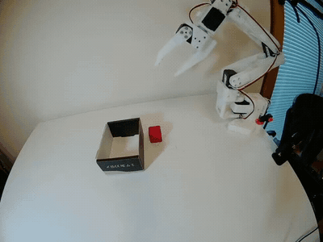
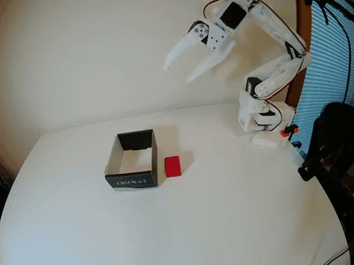
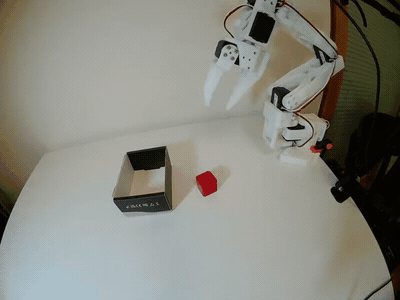
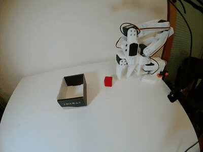
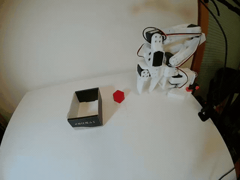
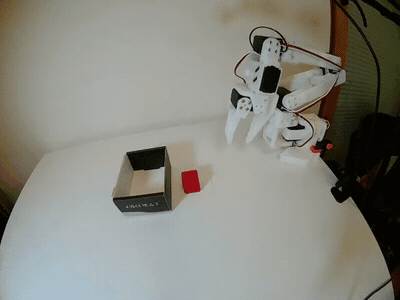

# SO-101 ACT Generalization

A real-robot study of ACT spatial generalization on SO-101 under progressively expanded demonstration distributions.

This project investigates how an **Action Chunking Transformer (ACT)** policy behaves as the training distribution is gradually expanded from fixed pick-and-place demonstrations to discrete spatial variations and finally to continuous object-position and orientation variations.

The full pipeline includes real-robot teleoperation, demonstration collection, ACT training, systematic rollout evaluation, and failure analysis.

---

## Overview

The project is organized into three stages:

1. **Stage 1 — Fixed Pick-and-Place**  
   Validate the complete real-robot imitation-learning pipeline with a fixed object position.

2. **Stage 2 — Discrete Spatial Generalization**  
   Train ACT on discrete object positions and evaluate both seen and unseen grid locations.

3. **Stage 3 — Continuous Pose Randomization**  
   Expand the dataset with continuous object-position and orientation variations and evaluate whether a larger and more diverse demonstration distribution improves generalization.

The main observation is that simply increasing demonstration diversity did **not** automatically improve policy robustness.

The Stage 2 policy achieved strong performance on discrete spatial variations, while the mixed Stage 2+3 policy showed substantially lower success rates on both continuous poses and the original grid distribution.

<!-- TODO: Insert project overview figure / pipeline diagram here -->

---

## Hardware Setup

- **Robot:** Waveshare SO-ARM101
- **Control:** Leader-follower teleoperation for demonstration collection
- **Policy deployment:** SO-ARM101 follower arm
- **Cameras:** Top view + side view
- **Camera resolution:** 640 × 480
- **Camera frame rate:** 30 FPS
- **Training framework:** LeRobot 0.6.1
- **Policy:** Action Chunking Transformer (ACT)
- **Training GPU:** NVIDIA RTX 4060 Laptop GPU, 8 GB VRAM
- **Operating system:** Ubuntu 22.04

The follower arm uses six joint-position dimensions:

```text
shoulder_pan
shoulder_lift
elbow_flex
wrist_flex
wrist_roll
gripper
```

Both robot state and policy action are represented in the same 6-D joint space.

<!-- TODO: Insert hardware setup photo here -->

<!-- TODO: Insert top and side camera views here -->

---

## Task

The task is a real-robot pick-and-place problem:

> Pick up the red cube and place it inside a fixed target box.

The target box, cameras, robot base, and general workspace remain fixed throughout the project.

The object distribution is progressively expanded across the three stages.

---

## Dataset Design

### Stage 1 — Fixed Position

Stage 1 is designed as a pipeline validation experiment.

- **Demonstrations:** 30
- **Object position:** Fixed
- **Object orientation:** Fixed
- **Target:** Fixed
- **Cameras:** Top + side

The goal is to verify the complete workflow:

```text
Teleoperation
    ↓
Demonstration Collection
    ↓
ACT Training
    ↓
Real-Robot Rollout
```

<!-- TODO: Insert Stage 1 example GIF/video here -->

---

### Stage 2 — Discrete Spatial Generalization

Stage 2 increases the spatial diversity of the demonstrations.

- **Demonstrations:** 50
- **Training distribution:** Discrete object positions
- **Evaluation:** 9-position grid
- **Target:** Fixed
- **Object orientation:** Approximately fixed

The evaluation grid contains nine spatial locations:

```text
A   B   C
D   E   F
G   H   I
```

The training distribution covers only part of the evaluation grid, allowing the policy to be tested separately on:

- **Seen positions**
- **Unseen positions**

This stage evaluates whether ACT can generalize from demonstrated locations to nearby discrete positions that were not directly included in the training distribution.

<!-- TODO: Insert Stage 2 grid illustration here -->

---

### Stage 3 — Continuous Position and Orientation Variation

Stage 3 adds 50 new demonstrations with a broader distribution.

The final training set therefore contains:

```text
50 Stage 2 demonstrations
+
50 Stage 3 demonstrations
=
100 demonstrations
```

The new demonstrations introduce:

- Continuous object-position variation
- Moderate object yaw variation
- More difficult workspace regions
- Additional boundary cases

The Stage 3 demonstrations were collected in several batches to increase spatial diversity while keeping the target position and camera configuration fixed.

The final 100-demonstration dataset was used to train a new ACT policy from scratch.

<!-- TODO: Insert Stage 3 data collection examples here -->

---

## Training

All ACT models were trained using LeRobot.

### Stage 1

```text
Episodes: 30
Training steps: 20,000
Batch size: 8
```

### Stage 2

```text
Episodes: 50
Training steps: 30,000
Batch size: 8
```

### Stage 3

```text
Episodes: 100
Training steps: 30,000
Batch size: 8
```

For the 100-episode dataset, 30k training steps with a batch size of 8 correspond to roughly 5.95 dataset passes based on the total number of training samples processed.

The complete training commands are available in:

```text
configs/
├── train_stage1_fixed.sh
├── train_stage2_grid.sh
└── train_stage3_mixed100.sh
```

---

## Evaluation Protocol

### Stage 2 Evaluation

The Stage 2 policy was evaluated over:

```text
5 rounds × 9 grid positions = 45 rollouts
```

A rollout is counted as a **success** if:

1. The cube is successfully grasped.
2. The cube is transported to the target.
3. The cube is placed inside the box before the episode ends.

A rollout is counted as a **retry success** if the first grasp fails but the policy autonomously recovers and completes the task during the same episode.

---

### Stage 3 Core Evaluation

The Stage 3 policy was evaluated over:

```text
5 rounds × 9 spatial regions = 45 rollouts
```

Unlike Stage 2, the cube was placed at a new continuous position inside each region.

The five rounds used different approximate yaw conditions:

```text
R1:   0°
R2: -15°
R3: +15°
R4: -30°
R5: +30°
```

This protocol evaluates both spatial and orientation generalization.

---

### Stress Test

An additional five rollouts were performed using:

- Workspace boundary positions
- Difficult workspace regions
- Larger orientation perturbations

These rollouts are reported separately from the core evaluation.

---

### Original-Grid Retest

To determine whether the mixed Stage 2+3 model retained the original Stage 2 capability, the 100-demonstration policy was reevaluated on the original fixed grid distribution.

Three rounds were performed:

```text
3 rounds × 9 positions = 27 rollouts
```

---

## Results

### Summary

| Policy / Evaluation | Success Rate |
|---|---:|
| Stage 2 ACT — overall grid | **39 / 45 (86.7%)** |
| Stage 2 ACT — seen positions | **23 / 25 (92.0%)** |
| Stage 2 ACT — unseen positions | **16 / 20 (80.0%)** |
| Stage 2+3 ACT — continuous pose evaluation | **15 / 45 (33.3%)** |
| Stage 2+3 ACT — stress test | **1 / 5 (20.0%)** |
| Stage 2+3 ACT — original grid retest | **11 / 27 (40.7%)** |

---

## Stage 2 Results

The Stage 2 policy achieved:

```text
39 / 45 = 86.7%
```

Performance on seen and unseen locations was:

```text
Seen:   23 / 25 = 92.0%
Unseen: 16 / 20 = 80.0%
```

This indicates that ACT was able to generalize reasonably well to discrete spatial locations that were not directly included in the training set.

[Watch the Stage 2 seen-position success example below.](#stage2-seen-demo)

[Watch the Stage 2 unseen-position success example below.](#stage2-unseen-demo)

<!-- TODO: Insert Stage 2 retry-success GIF -->

---

## Stage 3 Continuous Evaluation

The Stage 2+3 model achieved:

```text
15 / 45 = 33.3%
```

The per-round performance was:

| Round | Approx. Yaw | Successful Regions | Success Rate |
|---|---:|---|---:|
| R1 | 0° | B, G, H | 3 / 9 (33.3%) |
| R2 | -15° | C, D, F, H | 4 / 9 (44.4%) |
| R3 | +15° | C, F | 2 / 9 (22.2%) |
| R4 | -30° | C, D, H, I | 4 / 9 (44.4%) |
| R5 | +30° | G, I | 2 / 9 (22.2%) |
| **Total** | — | — | **15 / 45 (33.3%)** |

Five of the 15 successful rollouts required an autonomous retry after an initial grasp failure.

The retry successes were:

```text
R1: B, G
R4: D, I
R5: I
```

[Watch the Stage 3 continuous-pose success example below.](#stage3-success-demo)

[Watch the Stage 3 retry-success example below.](#stage3-retry-demo)

---

## Stage 3 Stress Test

The policy succeeded in:

```text
1 / 5 = 20.0%
```

stress-test rollouts.

The only successful stress-test episode required a retry and completed the task under a relatively favorable final configuration.

The stress test therefore indicates limited extrapolation toward more extreme workspace and orientation conditions.

[Watch the stress-test example below.](#stage3-stress-demo)

---

## Original-Grid Retest

The 100-demonstration policy was reevaluated on the original Stage 2 grid.

Results:

| Round | Successful Positions | Success Rate |
|---|---|---:|
| R1 | C, E, F, G, H, I | 6 / 9 (66.7%) |
| R2 | B, E, G, H | 4 / 9 (44.4%) |
| R3 | G | 1 / 9 (11.1%) |
| **Total** | — | **11 / 27 (40.7%)** |

Two of the 11 successful rollouts were retry successes:

```text
R1: H
R2: E
```

The first-attempt success rate was therefore:

```text
9 / 27 = 33.3%
```

Performance by position:

| Position | Success |
|---|---:|
| A | 0 / 3 |
| B | 1 / 3 |
| C | 1 / 3 |
| D | 0 / 3 |
| E | 2 / 3 |
| F | 1 / 3 |
| G | 3 / 3 |
| H | 2 / 3 |
| I | 1 / 3 |

Using the original Stage 2 seen/unseen split:

```text
Seen positions (A, C, E, G, I):
7 / 15 = 46.7%

Unseen positions (B, D, F, H):
4 / 12 = 33.3%
```

<!-- TODO: Insert original-grid retest success GIF -->

<!-- TODO: Insert original-grid degradation/failure GIF -->

---

## Rollout Examples

Representative real-robot rollouts are shown below.

The repository contains selected examples rather than every recorded evaluation episode.

<a id="stage2-seen-demo"></a>
<a id="stage2-unseen-demo"></a>

### Stage 2

| Seen Position | Unseen Position |
|---|---|
| [](videos/stage2_seen_r1_ep04_side.mp4) | [](videos/stage2_unseen_r2_ep07_side.mp4) |
| R1 · Episode 4 (index 3) · Side view · Seen-position success · 1× speed | R2 · Episode 7 (index 6) · Side view · Unseen-position success · 1× speed |

Source episode and timing are recorded in [the demo manifest](videos/manifest.csv).

<a id="stage3-retry-demo"></a>
<a id="stage3-success-demo"></a>

### Stage 3

| Continuous Pose | Retry / Recovery |
|---|---|
| [](videos/stage3_success_r2_ep04_side.mp4) | [](videos/stage3_retry_r4_ep09_side.mp4) |
| R2 · Episode 4 (index 3) · Side view · Continuous-pose success · 1× speed | R4 · Episode 9 (index 8) · I · Side view · Retry success · 1× speed |

Source episode and timing are recorded in [the demo manifest](videos/manifest.csv).

<a id="stage3-stress-demo"></a>
<a id="stage3-failure-demo"></a>

### Failure Cases

| Stress Test | Representative Failure |
|---|---|
| [](videos/stage3_stress_ep02_side.mp4) | [](videos/stage3_failure_r1_ep01_side.mp4) |
| Episode 2 (index 1) · Side view · Stress test · 1× speed | R1 · Episode 1 (index 0) · Side view · Representative failure · 1× speed |

Source episode and timing are recorded in [the demo manifest](videos/manifest.csv).

The complete numerical evaluation results are provided in the `results/` directory.

---

## Failure Analysis

### 1. More diverse demonstrations did not improve robustness

The mixed 100-demonstration policy achieved **33.3%** on continuous poses and **40.7%** on the original grid, where Stage 2 achieved **86.7%**. Performance therefore declined even on the earlier evaluation distribution. Greater trajectory variation may have made learning harder, but these experiments do not isolate the effects of dataset size, pose diversity, or training budget.

---

### 2. Data quality and top-view occlusion

The arm and gripper can obscure the cube in the top view during approach and closure, making its pose and grasp outcome harder to observe. The side camera provides another view, but whether it fully compensates for this occlusion has not been evaluated.

Demonstration consistency also matters: differences in approach paths, pauses, and grasp timing can create conflicting action targets for similar observations. Camera placement and episode-level visual review should accompany dataset expansion. Numerical integrity checks alone do not establish demonstration quality; the contribution of these factors to the performance drop remains unmeasured.

---

### 3. Recovery was strongly dependent on the post-failure object state

Several episodes showed autonomous retry behavior.

Recovery was occasionally successful when the first failed grasp left the object close to a familiar state.

However, if the first grasp failure caused the robot to:

- push the cube toward the target box,
- collide with the box,
- or push the cube outside the familiar workspace,

the second attempt was rarely successful.

A typical failure sequence was:

```text
Initial grasp failure
        ↓
Object displaced by robot
        ↓
Observation moves outside familiar training distribution
        ↓
Second attempt fails
```

This suggests that the observed retry behavior should not be interpreted as a robust general-purpose recovery policy.

---

### 4. Shorter action execution horizon did not improve performance

An additional inference experiment reduced:

```text
n_action_steps: 100 → 25
```

to increase the frequency of visual replanning.

This did not produce a clear improvement in task success.

Instead, the robot showed more abrupt motion changes between successive action chunks.

A possible explanation is that more frequent replanning exposed inconsistencies between independently predicted action chunks.

This experiment was treated as a qualitative inference ablation and was not included in the main success-rate table.

---

## Key Takeaways

The main observations from this project are:

1. **ACT can achieve strong real-robot performance on a moderately varied discrete spatial distribution.**

2. **Good performance on unseen discrete positions does not necessarily imply robust generalization to continuous pose variations.**

3. **Increasing dataset size and diversity can introduce additional multimodality and trajectory inconsistency.**

4. **A larger demonstration dataset does not automatically produce a stronger policy.**

5. **Retry behavior is useful but highly dependent on whether the failed interaction keeps the environment close to the training distribution.**

6. **Real-robot evaluation is essential: training loss alone was not predictive of final rollout robustness.**

---

## Analysis Tools

The stage-specific checking scripts have been consolidated into one CLI. Supply the dataset root for the experiment you want to analyze:

```bash
# Dataset quality (omit --skip-video to validate video frame counts as well).
python scripts/check.py dataset data/grid5_t1_50ep --expected-episodes 50 --skip-video

# Compare every recorded rollout episode with demonstrations.
python scripts/check.py rollout data/rollout_act_fixed_v2_eval10_cap10 --train data/fixed_v2_standardized_30ep --skip-video

# Post-closure movement and a specified analysis threshold.
python scripts/check.py transport data/rollout_act_fixed_v2_cap10_full1 --train data/fixed_v2_standardized_30ep --clamp 10

# Locate an episode from LeRobot v3 metadata without opening a player.
python scripts/play_episode.py data/grid5_t1_50ep 27 side --dry-run
```

Reports are written into a separate directory for each run under `logs/checks/<dataset>/`. FPS comes from dataset metadata; rollout and transport analysis process episodes individually. These offline checks do not determine task success or change robot control settings.

Install the offline dependencies with `python -m pip install -r requirements.txt`; video tools also require FFmpeg/ffprobe/ffplay. Run regression tests with `python -m unittest discover -s tests -v`.

Fixed-position recording now uses `bash scripts/record_fixed.sh DATA_ROOT REPO_ID [NUM_EPISODES] [RESUME]`. Grid5 retains its dedicated round-order script. See the [usage and migration guide](docs/script_usage.md) for all options and the [reproduction status](docs/reproducibility_status.md) for remaining limitations.

---

## Repository Structure

The layout includes planned documentation, training/rollout launchers, result tables, and media that are still being added. The current analysis tools are listed under `scripts/`; saved training JSON configurations are available under `configs/stage1_fixed/`, `configs/stage2_grid/`, and `configs/stage3_mixed/`.

```text
so101-act-generalization/
│
├── README.md
│
├── LICENSE
├── .gitignore
│
├── configs/
│   ├── train_stage1_fixed.sh
│   ├── train_stage2_grid.sh
│   ├── train_stage3_mixed100.sh
│   ├── rollout_stage2.sh
│   ├── rollout_stage3.sh
│   └── rollout_grid_retest.sh
│
├── docs/
│   ├── hardware_setup.md
│   ├── data_collection.md
│   ├── training.md
│   ├── evaluation_protocol.md
│   └── failure_analysis.md
│
├── results/
│   ├── stage2_grid_results.csv
│   ├── stage3_continuous_results.csv
│   ├── stage3_stress_results.csv
│   ├── grid_retest_results.csv
│   └── figures/
│
├── videos/
│   ├── overview.mp4
│   ├── stage2/
│   ├── stage3/
│   └── failures/
│
├── assets/
│   ├── setup_photo.jpg
│   ├── workspace_grid.png
│   └── camera_views.png
│
└── scripts/
    ├── check.py
    ├── dataset_utils.py
    ├── play_episode.py
    ├── record_fixed.sh
    ├── record_grid5_t1_round.sh
    └── concat_F_rollouts.py
```

---

## Software

This project was built using:

- LeRobot 0.6.1
- PyTorch
- OpenCV
- FFmpeg
- Ubuntu 22.04

ACT training and real-robot deployment were performed using the LeRobot training and rollout pipelines.

---

## Reproduction

The repository contains the commands used for:

- Real-robot data collection
- ACT training
- Dataset inspection
- Real-robot rollout evaluation

Full raw datasets and checkpoints are not stored directly in the GitHub repository.

<!-- TODO: Add dataset/checkpoint download links if released -->

---

## Future Work

This project serves as an imitation-learning baseline for subsequent experiments with vision-language-action policies.

Planned extensions include:

- π0.5 fine-tuning on SO-101
- Language-conditioned object selection
- Shape insertion tasks
- More structured failure-driven data collection
- Reinforcement-learning post-training

---

## Acknowledgements

This project is built on top of the [LeRobot](https://github.com/huggingface/lerobot) framework.

---

## License

<!-- TODO: Add license information -->
